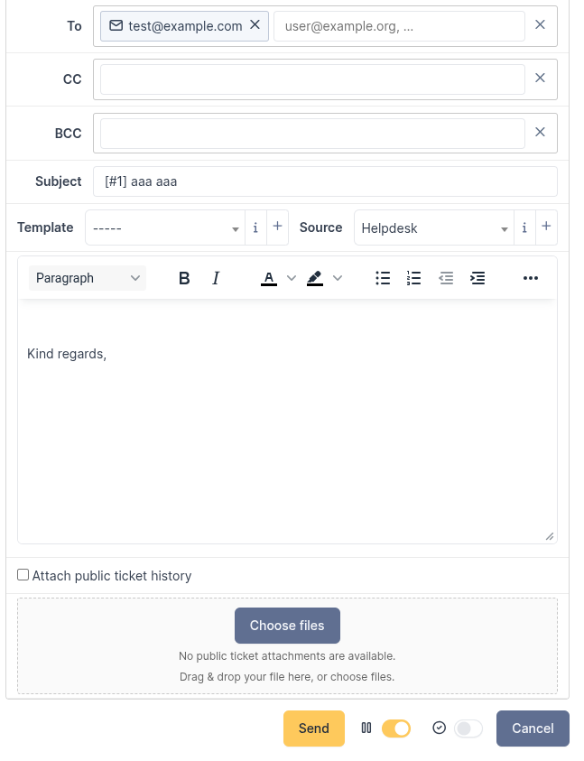
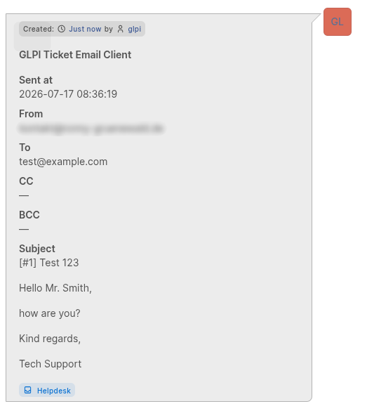
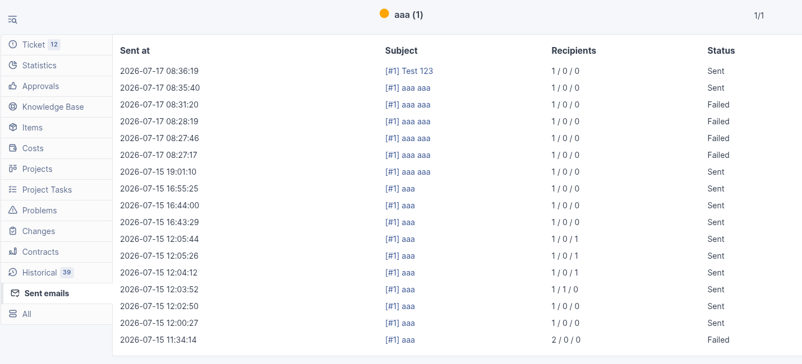

# GLPI Ticket Email Client

A plugin for **GLPI 11**. It lets ticket agents send emails directly from a ticket.

Sent emails are shown in the ticket history and send log.

> **Compatibility:** PHP 8.2 or later; GLPI 11.0.x. Tested with GLPI 11.0.8.

## See it in GLPI

Write a formatted email from a ticket. The sent email stays visible in the ticket history.

<p align="center">
  
  
</p>

The send log shows successful and failed attempts. Only ticket readers can view it.

<p align="center">
  
</p>

## Features

- Choose **Email** (default) or **Internal note** when replying from a ticket.
- Email keeps Ticketmailer's To/CC/BCC, signature, audit, and direct SMTP workflow.
- Internal note mounts GLPI's native private-followup form; it has no Ticketmailer recipients or generated signature and never enters Ticketmailer's audit/SMTP pipeline. GLPI's configured native followup notifications remain unchanged.
- Write formatted messages.
- Add files, images, and public ticket history.
- Use GLPI's existing mail settings.
- Keep sent emails in the ticket history and send log.
- Choose a ticket template for each entity.
- Available in English and German.

## Important security and privacy behavior

Read this section before installing the plugin.

- Everyone who can read a ticket can also see its BCC recipients.
- BCC recipients are hidden from recipients of the email.
- Only ticket readers can open stored attachments.
- A warning appears if an address matches a GLPI mail collector.
- The plugin sends each email only once. It does not retry automatically.
- A send is incomplete if the email was sent but could not be added to the ticket history. Do not send it again.

## Requirements

- GLPI 11.0.x.
- PHP 8.2 or later.
- A working GLPI core SMTP configuration.
- A GLPI user who can update tickets or add followups.
- Ticket readers can view the send log and stored attachments.
- Database permissions sufficient for GLPI plugin installation and upgrade.

## Installation

1. Download a release archive or clone this repository.
2. Place the source in the GLPI plugins directory as `ticketmailer`:

   ```text
   <glpi-root>/plugins/ticketmailer
   ```

3. Ensure the web-server user can read the plugin files and write GLPI's configured document directory.
4. From the GLPI root, install and enable the plugin:

   ```bash
   php bin/console plugin:install ticketmailer
   php bin/console plugin:enable ticketmailer
   ```

5. Configure SMTP under GLPI's core mail settings. GLPI Ticket Email Client has no SMTP host, credentials, or transport settings of its own.
6. Open a ticket as an authorized agent and verify that **Email reply** appears beside **Answer**.

### Upgrade

1. Back up the GLPI database and document directory using your normal GLPI maintenance procedure.
2. Replace the plugin directory with the new release while preserving the directory name `ticketmailer`.
3. Run GLPI's plugin update flow from the administration UI or CLI.
4. Confirm that the plugin reports version `2.0.0` and execute the smoke checks below.

The installer applies the versioned database migrations included in `sql/`. Do not edit plugin tables manually during an upgrade.

## Configuration

### SMTP

Configure email delivery in GLPI. The plugin has no separate mail settings.

### Per-entity preferences

A GLPI administrator can open the plugin configuration page and choose an entity. The following settings are available:

- **Ticket notification template** — choose one ticket template for each entity.
  - Child entities can inherit it.
  - It fills the subject and adds an editable signature.
  - Recipients still come from the email form.
  - Users only see data they are allowed to view.
- **Set ticket status to waiting after sending** — enabled by default.
- **Show newest ticket entries first** — enabled by default.

The plugin does not hide GLPI's own reply button.

## Email or Internal note

Open **Email reply**, then choose a mode. **Email** is selected by default. Each mode keeps its own mounted draft and attachments when switching.

**Internal note** uses GLPI's native private-followup form, with private visibility enforced. Native permissions, CSRF, editor/uploads, templates, source, pending reasons/status, timeline/history, merged tickets, and notification configuration remain authoritative.

## Sending an email

1. Open a ticket and select **Email reply**.
2. Add at least one recipient.
3. Check the subject and message.
4. Add files or public ticket history if needed.
5. Review any warning shown by GLPI.
6. Select **Send** once.

The send is complete when the email appears in the ticket history.

If it does not appear, check the send log. Do not send it again until you know whether it was delivered.

## Data stored by the plugin

The plugin stores sent messages, recipients, files, delivery results, and ticket-history links.

Only ticket readers can open this data. Set suitable backup, deletion, and retention rules for your organization.

## Non-goals

GLPI Ticket Email Client does not provide:

- inbound email processing, IMAP polling, or reply parsing;
- email drafts, scheduled delivery, a queue, or automatic retry;
- SMTP configuration or credentials separate from GLPI;
- a generic mail client or workflow engine;
- a GLPI core patch;
- a guaranteed mail-loop detector.

## Development and verification

The repository includes one local GLPI/MariaDB development stack shared by all Git worktrees. Starting Compose from another worktree reuses the test instance and switches its mounted plugin source to that worktree. Configure a real SMTP server in `.env` (ignored by Git):

```dotenv
GLPI_SMTP_HOST=smtp.example.com
GLPI_SMTP_PORT=587
GLPI_SMTP_MODE=3
GLPI_SMTP_USERNAME=developer@example.com
GLPI_SMTP_PASSWORD=replace-with-a-local-secret
```

`GLPI_SMTP_HOST` is required for automatic SMTP configuration. `GLPI_SMTP_PORT` defaults to `587`; `GLPI_SMTP_MODE` defaults to `3` (STARTTLS). Use `1` for plain SMTP or `2` for implicit TLS. Username and password may be empty when the server does not require authentication. These values configure GLPI core; the plugin has no SMTP settings.

```bash
docker compose up -d --build
```

GLPI is available at `http://localhost:8080` (`glpi` / `glpi` in the development stack only). Change the default login immediately.

Run the reproducible test container from the repository root. It installs the locked PHP dependencies into Docker volumes, then runs PHPUnit and the canonical v2 verifier:

```bash
docker compose run --rm test
```

Before a release, use a dedicated SMTP test receiver to test one complete email with recipients, attachments, and warnings. Also test failed delivery and a missing ticket-history entry. The receiver must contain exactly one email; its visible headers must not contain BCC.

## Repository layout

```text
ajax/       Upload, recipient validation, and autocomplete endpoints
css/        Plugin styles
front/      GLPI front controllers
inc/        Plugin domain and integration classes
js/         Compose and ticket-timeline behavior
locales/    Gettext template and English/German catalogues
sql/        Fresh-install schema and upgrade migrations
templates/  Twig views
tests/      PHPUnit and browser-behavior tests
docker/     Local GLPI development image
```

## Contributing and security

See [CONTRIBUTING.md](CONTRIBUTING.md) for development and contribution rules. See [SECURITY.md](SECURITY.md) for vulnerability reporting.

## License

Copyright © Ronny Gruenewald.

Licensed under the [GNU General Public License, version 3 or later](LICENSE).
