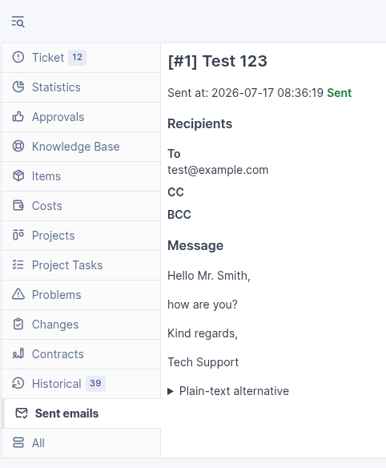

<!-- markdownlint-disable MD013 -->

# Benutzerhandbuch (Deutsch)

[Wiki-Startseite](Home) · [English](User-Guide-EN)

## 1. E-Mail aus einem Ticket senden

1. Öffnen Sie das Ticket.
2. Wählen Sie **E-Mail antworten**.
3. Das Antwortformular öffnet sich im Ticket.
4. Wählen Sie **E-Mail** oder **Interne Notiz**. **E-Mail** ist bereits ausgewählt.

Mit **E-Mail** schreiben Sie an Personen außerhalb des Tickets. **Interne Notiz** ist nur für Mitarbeitende gedacht, die das Ticket sehen dürfen. Bei einer internen Notiz gibt es keine E-Mail-Empfänger und keine E-Mail-Signatur.

Fehlt **E-Mail antworten**? Wenden Sie sich an Ihren GLPI-Administrator.

## 2. Interne Notiz schreiben und Wissensdatenbank nutzen

1. Wählen Sie oben **Interne Notiz**.
2. Schreiben Sie Ihre Notiz in das Nachrichtenfeld.
3. Fügen Sie bei Bedarf Dateien hinzu.
4. Prüfen Sie die Schalter **Wartend** und **Gelöst**.
5. Speichern Sie die Notiz.

Die Notiz ist immer intern. Nur Personen mit Zugriff auf das Ticket können sie sehen. Es wird keine E-Mail versendet.

Mit **Antwortvorlagen** können Sie vorbereiteten Text in die Notiz übernehmen. Wählen Sie eine Vorlage und prüfen Sie den eingefügten Text. Sie können den Text danach ändern.

### Text in der Wissensdatenbank suchen

1. Wählen Sie im Formular **Wissensdatenbank**.
2. Suchen Sie nach einem passenden Artikel.
3. Prüfen Sie den Artikel.
4. Übernehmen Sie den Artikel in die Notiz.
5. Passen Sie den übernommenen Text bei Bedarf an.

Beim Übernehmen ersetzt der Artikel den Text im Nachrichtenfeld. Kopieren Sie deshalb vorher Text, den Sie noch benötigen.

## 3. Empfänger wählen

Das Formular bietet **An**, **CC** und **BCC**.

Diese Empfänger sind oft schon eingetragen:

- Anforderer → **An**
- Beobachter → **CC**

Sie können weitere Empfänger hinzufügen:

- Geben Sie einen Namen ein und wählen Sie die passende Person aus der Liste.
- Sie können auch eine E-Mail-Adresse eingeben.
- Mehrere Adressen trennen Sie mit Komma, Semikolon oder der Eingabetaste.

Sie müssen mindestens eine gültige Adresse eintragen. Eine falsche Adresse wird markiert. Sie können eine E-Mail auch nur über **BCC** senden.

### BCC ist im Ticket sichtbar

Empfänger der E-Mail sehen die BCC-Adressen nicht.

Alle Personen, die das Ticket lesen dürfen, können die BCC-Adressen im Ticket sehen.

Verwenden Sie BCC deshalb nicht, um Adressen vor diesen Personen zu verbergen.

## 4. Betreff und Nachricht schreiben

- Füllen Sie **Betreff** und **Nachricht** aus.
- GLPI fügt die Ticketnummer in den Betreff ein. Dadurch wird eine Antwort wieder diesem Ticket zugeordnet.
- Wählen Sie **Neue Konversation beginnen** nur, wenn die Antwort nicht mehr zu diesem Ticket gehören soll. Eine Antwort kann dann ein neues Ticket erstellen.
- Sie können den Text gestalten.
- Sie können Betreff, Nachricht und Signatur ändern.
- E-Mail-Empfänger aus einer Vorlage werden nicht übernommen.
- Sie sehen nur Informationen, die Sie sehen dürfen.

### Antwort- und Lösungsvorlagen verwenden

**Antwortvorlagen** kopieren vorbereiteten Text in die Zwischenablage.

1. Wählen Sie unter **Antwortvorlagen** eine Vorlage.
2. Warten Sie auf die Bestätigung **Text kopiert**.
3. Fügen Sie den Text an der gewünschten Stelle ein.

Die Vorlage enthält HTML und Klartext. Durch die Auswahl werden die aktuelle Nachricht und E-Mail-Signatur nicht verändert.

**Lösungsvorlagen** funktionieren genauso. Durch die Auswahl werden weder die Nachricht noch der Ticketstatus verändert.

## 5. Dateien und Bilder hinzufügen

### Neue Dateien

Wählen Sie **Dateien auswählen**. Sie können Dateien auch in den Anhangsbereich ziehen.

Prüfen Sie die Dateien vor dem Senden. Wenn eine Datei zu groß ist, zeigt GLPI eine Meldung an.

### Bilder in der Nachricht

Ziehen Sie ein Bild in das Nachrichtenfeld. Sie können ein kopiertes Bild dort auch einfügen.

### Dateien aus dem Ticket

Sie können vorhandene Dateien aus dem Ticket auswählen. Dazu gehören Dateien am Ticket und Dateien aus öffentlichen Antworten. Mit dem Link neben einer Datei können Sie diese vor dem Senden prüfen.

Die Dateiauswahl und **Öffentlichen Ticketverlauf anhängen** sind zwei verschiedene Optionen. Dateien aus internen Notizen werden nicht angezeigt.

## 6. Öffentlichen Ticketverlauf anhängen

Wählen Sie **Öffentlichen Ticketverlauf anhängen**, wenn die Empfänger die bisherigen öffentlichen Antworten sehen sollen.

Diese Option ist zunächst ausgeschaltet. Interne Notizen werden nie mitgesendet.

## 7. Ticketstatus wählen

Unten im Formular finden Sie zwei Schalter:

- Das Pausenzeichen steht für **Wartend**.
- Das Häkchen steht für **Gelöst**.

Sie können nur einen der beiden Schalter einschalten. Wenn Sie einen einschalten, wird der andere automatisch ausgeschaltet.

### Bei einer E-Mail

**Ticketstatus nach dem Senden auf wartend setzen.** ist normalerweise bereits eingeschaltet. Möchten Sie den Status nicht ändern? Dann schalten Sie **Wartend** aus. Sie können stattdessen **Gelöst** einschalten.

Der Status ändert sich erst, wenn die E-Mail erfolgreich versendet und im Ticket gespeichert wurde.

### Bei einer internen Notiz

Schalten Sie **Wartend** oder **Gelöst** nur ein, wenn Sie den Ticketstatus zusammen mit der Notiz ändern möchten. Der Status ändert sich, nachdem die Notiz gespeichert wurde.

## 8. Warnung bei einer Empfängeradresse

GLPI warnt Sie, wenn eine Adresse möglicherweise wieder zurück an GLPI führt. Dadurch könnten unnötig viele E-Mails entstehen.

1. Prüfen Sie die Adresse.
2. Entfernen oder korrigieren Sie die Adresse bei Bedarf.
3. Ist die Adresse richtig? Dann bestätigen Sie die Warnung.
4. Wählen Sie noch einmal **Senden**.

GLPI kann nicht jede mögliche Weiterleitung erkennen. Prüfen Sie die Adresse deshalb sorgfältig.

## 9. E-Mail senden

1. Prüfen Sie Empfänger, Betreff und Nachricht.
2. Prüfen Sie Dateien und Statusoptionen.
3. Wählen Sie **Senden** einmal.

Wählen Sie **Senden** nicht noch einmal, während der Versand läuft. Bei einem Fehler versucht das Plugin nicht selbstständig, die E-Mail erneut zu senden.

## 10. Versand prüfen

Nach einem erfolgreichen Versand erscheint die E-Mail im Ticketverlauf.

Dort sehen Sie die Nachricht, die Empfänger und die Anhänge. Alle Personen mit Zugriff auf das Ticket können diese Angaben sehen.

Zusätzliche Details stehen im Tab **Gesendete E-Mails**.

## 11. E-Mail versendet, aber nicht im Ticket sichtbar

Manchmal wurde die E-Mail versendet, konnte aber nicht im Ticket gespeichert werden. GLPI zeigt dann **Unvollständiger Versand (Timeline fehlgeschlagen)** an.

**Senden Sie die E-Mail nicht noch einmal.** Die Empfänger haben sie möglicherweise bereits erhalten. Öffnen Sie **Gesendete E-Mails** und wenden Sie sich an Ihre GLPI-Administration.

## 12. Probleme lösen

| Problem | Lösung |
| --- | --- |
| **E-Mail antworten** fehlt | Wenden Sie sich an Ihre GLPI-Administration. |
| Adresse ist ungültig | Korrigieren oder entfernen Sie die Adresse. |
| Kein Empfänger | Tragen Sie mindestens eine Adresse ein. |
| Datei ist zu groß | Wählen Sie eine kleinere Datei. |
| Postfachwarnung erscheint | Prüfen Sie die Adresse. Bestätigen Sie nur bewusst. |
| Versand ist fehlgeschlagen | Öffnen Sie **Gesendete E-Mails** und wenden Sie sich an Ihre GLPI-Administration. |
| E-Mail wurde versendet, fehlt aber im Ticket | Senden Sie nicht erneut. Öffnen Sie **Gesendete E-Mails** und wenden Sie sich an Ihre GLPI-Administration. |
| Anhang lässt sich nicht öffnen | Prüfen Sie Anmeldung und Ticket-Leserecht. |
