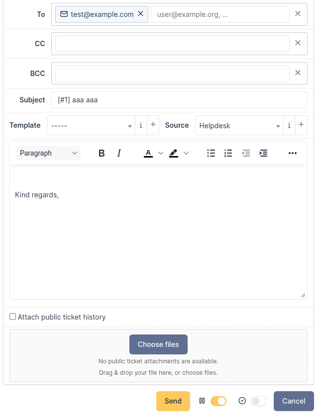
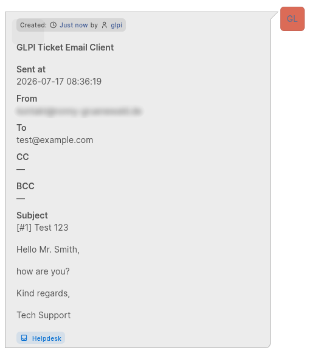
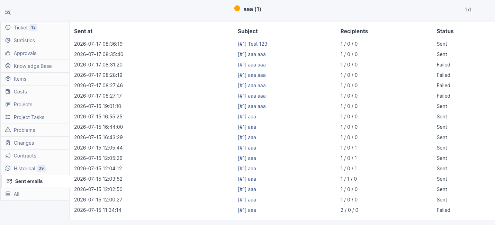
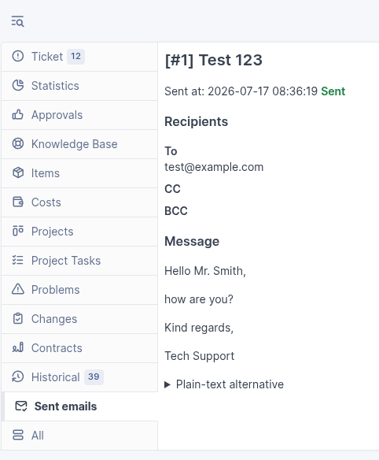

<!-- markdownlint-disable MD013 -->

# User Guide (English)

[Wiki home](Home) · [Deutsch](Benutzerhandbuch-DE)

## 1. Purpose

**Ticket Email Client** lets authorized users send email directly from a GLPI ticket. A successful send is then documented in the ticket timeline and send log.

## 2. Requirements

- You are signed in to GLPI.
- You can read the relevant ticket.
- Composing and sending requires permission to update the ticket or add follow-ups.
- The plugin feature must be available for your entity and profile.

If **Email reply** is missing, contact your GLPI administrator.

## 3. Compose email from a ticket

1. Open the required ticket.
2. In the ticket timeline, select **Email reply** or **Reply**.
3. The form opens inside the ticket.

Depending on configuration, the form may already be expanded when the ticket opens. GLPI's native reply control may remain visible as well.

## 4. Recipients

The form provides **To**, **CC**, and **BCC**.

### Automatic defaults

- Requesters → **To**
- Observers → **CC**

### Add recipients

- Find internal GLPI users with autocomplete.
- Enter external email addresses directly.
- Separate addresses with a comma, semicolon, or Enter.
- Remove one recipient with its remove control; **Clear** removes all entries from a field.

At least one valid address in **To**, **CC**, or **BCC** is required. BCC-only sending is allowed. Invalid entries are reported as errors, never silently discarded.

### Important: BCC visibility

BCC addresses are not included as visible To/CC headers in the delivered email. However, the complete BCC list is visible in the ticket timeline and send log to **every user who can read the ticket**. Do not use BCC to hide addresses from other ticket readers.

## 5. Subject and message

- **Subject** is required.
- **Message** must not be empty.
- The editor supports rich HTML content.
- Depending on GLPI configuration, template and source controls may be available.
- A configured signature or subject prefix may be inserted automatically.

## 6. Attachments and inline images

### Attach new files

- Select **Choose files** or drag files into the attachment area.
- Multiple files are supported.
- GLPI upload limits still apply.
- Remove accidentally added files before sending.

### Embed images in the message

Drop an image into the message editor or paste it from the clipboard. Only image files can be embedded inline.

### Include public ticket attachments

Existing ticket attachments can be selected individually within the attachments area. Use the open control to inspect an offered attachment in a new tab before sending.

Private notes and their documents are never offered or sent.

## 7. Attach public ticket history

Enable **Attach public ticket history** to append the public ticket history to the message body. It is unchecked by default.

Public ticket attachments are selected independently: history text and individual files can be included separately.

## 8. Ticket status after sending

Options beside **Send** may be available to set the ticket status automatically:

- set to **Waiting**;
- set to **Solved**.

Review these controls before sending. Administrators may define defaults.

## 9. Incoming mailbox warning

A warning appears when a recipient exactly matches the email address of an active GLPI mail receiver. This helps prevent a possible mail loop.

1. Review the matched recipients.
2. Remove or correct an unintended address.
3. To proceed deliberately, select **I understand and want to send anyway**.
4. Send again.

This is a best-effort check only. Aliases, forwarding, and non-email logins are not detected.

> The mailbox warning appears in the email form when GLPI detects a matching mail collector.

## 10. Send and result

1. Review recipients, BCC visibility, subject, message, attachments, and status options.
2. Select **Send**.
3. Do not click repeatedly. For each accepted send operation, the plugin performs exactly one attempt and does not retry automatically after an error.

### Possible results

- **Sent:** Delivery succeeded and the timeline entry was recorded.
- **Failed:** Delivery failed; no successful-send timeline follow-up was created.

## 11. Verify the send in the ticket

After complete success, a normal follow-up appears in the ticket timeline. It contains sender, sent time, To/CC/BCC, subject, message, and secure attachment links.

Every user who can read the ticket can view these details—including the full BCC list—and open the attachments.

## 12. Open the send log

The ticket tab **Sent emails** lists related log entries. Open an entry to review:

- recipients, including BCC;
- message and plain-text alternative;
- attachments and inline images;
- delivery status;
- error details;
- recorded confirmation of a mailbox warning.

Ticket-read permission is required.

## 13. Troubleshooting

| Problem | Action |
| --- | --- |
| **Email reply** is missing | Ask an administrator to check ticket rights and plugin availability for your entity/profile. |
| Invalid address | Correct or remove the complete entry shown in the error. |
| No recipient | Add at least one valid address to To, CC, or BCC. |
| Upload failed / file too large | Check file type and GLPI upload limits; try a smaller file; otherwise contact an administrator. |
| Mailbox warning | Review the recipient; proceed with the confirmation control only when intentional. |
| Send failed | Open the error details in the send log; contact an administrator. No automatic retry occurs. |
| Incomplete send | Do not resend; contact an administrator because SMTP delivery already succeeded. |
| Attachment does not open | Check your sign-in and ticket-read access; contact an administrator if the error persists. |
